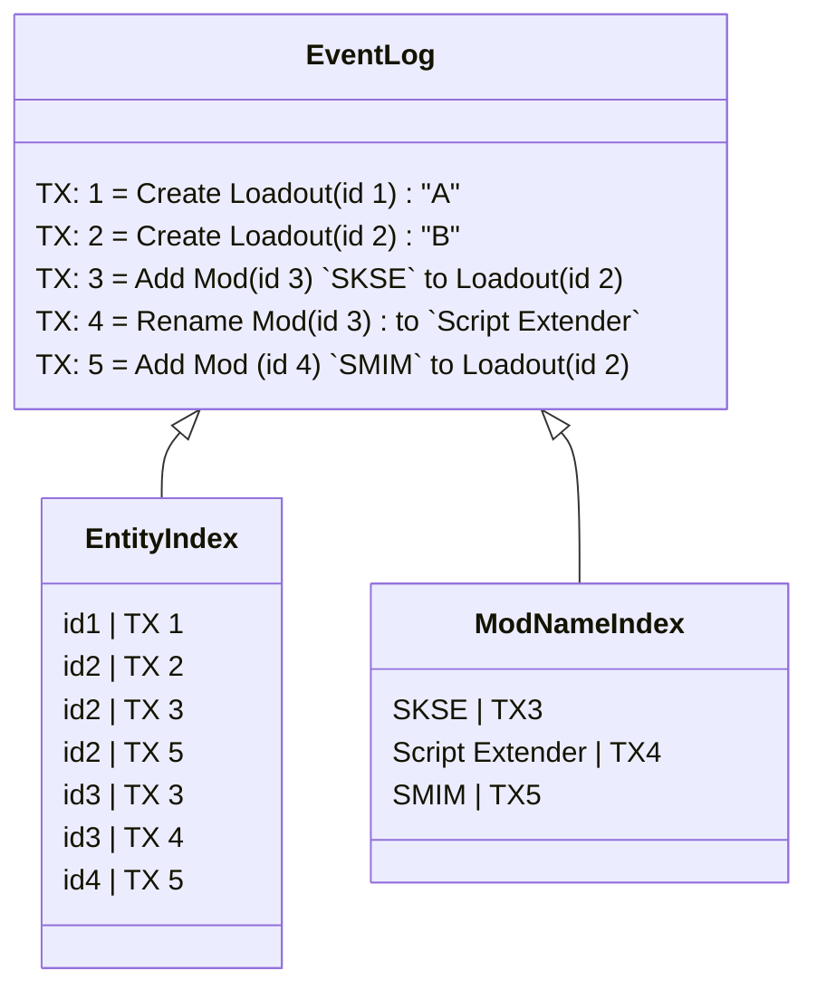

---
hide:
  - toc
---

## Secondary Indexes

Secondary indexes are a way to query an entity based on the most recent value of a given attribute. The "most recent value"
part of this creates a rather interesting problem: since the system can view the data at any transaction time, the indexes
must support the changing of values over time.

!!! info : "Indexing entities based on their EntityId is implemented with the same logic as secondary indexes."

The primary index for information in the system is a sorted list of all transactions. With each transaction having a monotonic
increasing transaction time, this allows for any transaction to be found with a single lookup in the event store. This stream
of data is then indexed by the secondary indexes to provide a quick way to lookup the transactions that influence a given
entity. Since all transactions are sorted by their transaction id, and the transaction id is a monotonically increasing value,
we can simply replay any matching events to get the current value of any attribute of an entity.

There are two primary ways to index attribute values:

### Collection Attributes
Attributes on an entity can be collections. A Loadout may include a list of mods, a mod may contain a list of files, etc. These
attributes can be updated to track a certain value on the child entity. So a Loadout may have a dictionary lookup Mod.Name to mod entity,
or a mod may have a lookup via the path to a file. This allows for a quick lookup of the child entity based on the parent entity.
Since the system also supports graph data structures, a mod could also link back to the loadout. While this is a very simple approach,
it does require all of the keys (and matching EntityIDs) to be loaded into memory. This is not a problem for small collections, but
for something like files in an archive, this could be a problem. So collection attributes should be prefered for small collections
or when the whole dataset will likely be loaded into memory anyway.

### Indexed Attributes
Some attributes are marked with `IIndexableAttribute`. This allows for the attribute to be indexed by the system. These attributes
must be scalar values, and their matching lookup properties must be marked with `IndexedAttribute`. When this occurs the system
will create a secondary index on that attribute. This index is a sorted composite index of `[attribute, value, transactionId]`. This allows
for all the events that contain a given attribute and value combination to be replayed in order. From there the transactions can be
replayed to find entities with a matching entity type, those entities can then be loaded, and the attribute can be checked to see if
it is infact the correct value.

!!! info : "Performance will degrade if an indexed attribute's value changes often. So try to keep indexes on attributes that are unlikely to change. Index a file's hash for example, but not the mod count in a loadout."

!!! warning : "Indexed attributes are not versioned, cannot be recreated. If the datamodel radically changes, the index will have to be deleted and *all* events in the store replayed to recreate it."

