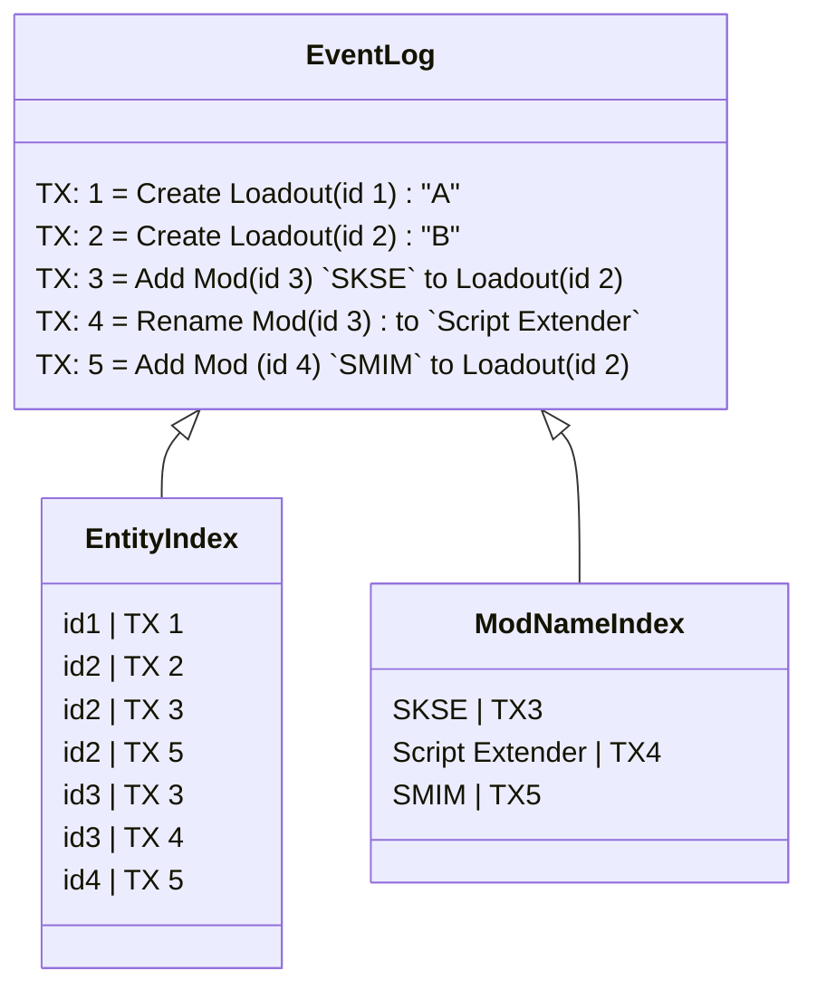

``---
hide:
  - toc
---

## Storage Model

The IEventStore is the primary interface for interacting with loading and saving events. At many times the data must be loaded
in a particular sort order, so storage systems that support bi-directional iteration of prefixed keys are prefered. For the initial
implementation the storage system will use RocksDB, but the interface is designed to be easily swapped out for other storage systems.

### Event Log
The event log, is a sorted Key Value store of every event in the system. The key in this store is a `ulong` of the monotonic increasing
transaction id. The value is the serialized event data.

### Entity Index
The entity index is a type of secondary index that allows for the lookup of all events that influence a given entity. This index is
a sorted composite index of `[entityId, transactionId]`, where the entity id is the UInt128 representation of the entity's unique identifier, and
transaction Id is stored as a `ulong`. The value is null.

### Entity Snapshot
Entity Snapshots are a serialized representation of an entity at a given transaction time. The key in this index is a composite of
`[entityId, transactionId]` where the entity id is the UInt128 representation of the entity's unique identifier, and transaction Id is stored as a `ulong`.
The value is in the following format:

```
UInt128 - Entity type Id
UShort - Entity revision
UShort - Number of attributes
foreach attribute:
    string - Attribute name (as defined by the string serializer)
    bytes* - Accumulator Value (as defined by the attribute type)
```

### Secondary Indexes
Additional secondary indexes can be created by users, these indexes are stored in a similar format to the Entity Index. The key is a composite of
`[attributeName, attributeValue, transactionId]`, and the values are null. In RocksDB each attribute name is stored as a separate column family, and
so the keys are only the composite of `[attributeValue, transactionId]`.

### Visual Diagram
All put together, the storage model in RocksDB looks like this:



