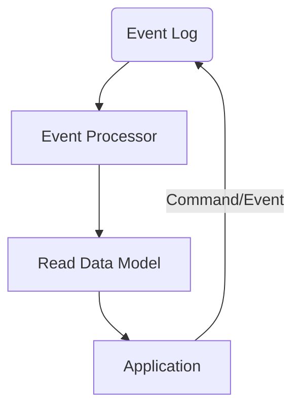
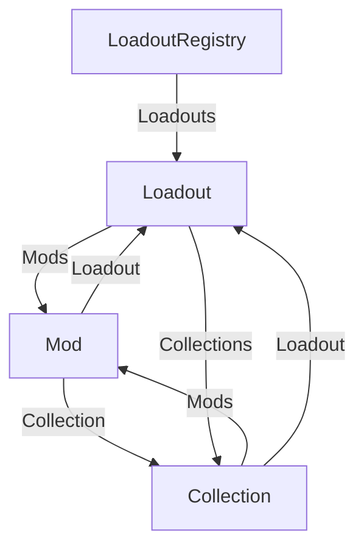

---
hide:
  - toc
---

<div align="center">
	<h1>The Nexus Event Sourcing Framework</h1>
	
	<br/> <br/>
    Event Sourcing for single process desktop applications.
    <br/>
    
</div>

## About

Event Sourcing, and more commonly CQRS, are patterns that are becoming more and more popular in the software industry especially
for large scale distributed systems. They are also patterns that fit well into a immutable state systems, or systems that wish
to track modifications to data and provide ways of auditing or undoing changes.

The term "Event Sourcing" was coined by [Martin Fowler in 2005](https://martinfowler.com/eaaDev/EventSourcing.html), and is described as:

!!! info "Event Sourcing ensures that all changes to application state are stored as a sequence of events. Not just can we query these events, we can also use the event log to reconstruct past states, and as a foundation to automatically adjust the state to cope with retroactive changes."

These features solve several problems we experience in the Nexus Mods App, namely:

* A strongly typed data model that can be quickly loaded from disk
* A way to track changes to the data model
* A way to undo changes to the data model
* A way to adapt the data model to changes in the data model, if a property changes from a string to a number, how do
  we adapt the data model to this change?

!!! tip "The concept of event sourcing is simple, given a set of events, the state of the system is then `aggregate({}, events) -> state`. All the state is the result of applying all the events in order"

What is interesting to note is that this pattern is very abstract, leaving a lot of room for optimization and customization. One such
customization is the idea of CQRS, or Command Query Responsibility Segregation. This is the idea that the system should be split into
two parts, the command side and the query side. The command side is responsible for handling commands, or actions that change the state
of the system. The query side is responsible for handling queries, or actions that read the state of the system. This pattern further
aligns with the idea of immutability, as the command side is the only side that can change the state of the system, and the query side
can be optimized for reading.

The overall architecture of a CQRS system is something like this:



* Events are sent into the Event Log, this storage is considered the "source of truth" for the system
* An event processor takes these events and uses them to manipulate the read data model
* The application then reads from the read data model
* The application can also send commands to the event log to modify the model

!!! tip "The event log is the source of truth for the system, and the read data model is a projection of the event log. The read data model can be rebuilt at any time by replaying the events in the event log"

## Nexus Event Sourcing Framework

This framework is a simplified and highly optimized version of the CQRS pattern. It is designed to be used in single process desktop
application and as such does not have to deal with the complexities of distributed systems, such as eventual consistency, or
distributed transactions. It also very opinionated about the shape of the read model, and the shape of events, this results in an extremely
high performance framework, but at the cost of some flexibility. Thankfully most of this complexity is hidden from users
and the application developer, and this process does *not* require any source generators or compile time code generation.

The first departure from more standard forms of CQRS is how the read model is structured. During development of this framework several
patterns were attempted and all but one resulted in extreme complexity, or performance issues. The final design retains a lot
of power of the CQRS pattern but adopts some concepts from immutable databases like Datomic and other `[entity, attribute, value]` systems.
First of all, a short overview of other patterns that were attempted.

!!! info "These patterns will be using an example datamodel, that is close to the one found in the nexus mods app. Loadouts are stored in a LoadoutRegistry, each loadout can have one or more mods, and loadouts may have collections that also contain links to mods in the loadout. So the model is a cyclic directed graph."



### The "objects are smart" pattern
This pattern matches some of the business model frameworks in C# like Entity Framework or CSLA.NET. In this pattern developers
create extremely rich domain objects that contain all the business logic and data for the application. The framework would then
track changes to this model and generate events that could be replayed.

In this pattern one would expect something like this (in pseudo code):

```python
class LoadoutRegistry(Entity):
  loadouts = {}

  @event
  def add_loadout(self, name, id):
    self.loadouts[id] = Loadout(name, id)
    return id

class Loadout(Entity):
  def __init__(self, id, name):
    self.id = id
    self.name = name
    self.mods = []
    self.collections = []

  @event
  def rename(self, name):
    self.name = name


with ctx.transaction as tx:
  registry = tx.get(LoadoutRegistry)
  id = registry.add_loadout("My Loadout", 1)
  tx.get(id).rename("My New Loadout")
```

This pattern has several drawbacks, firstly, capturing calls to methods is difficult especially in C#. We could define
these objects in some sort of DSL and have the methods generated and/or intercepted but that became more complex the more
the approach was investigated. Secondly, it's not clear from the code what parts of the code are part of the read model, and
what are parts of events. The original idea here would be to mark methods with `@event` and then have the framework generate
events for those methods, but that quickly makes the code unclear what parts of the class would need to be serialized (the method arguments)
and what will be generated.

### The "events are objects too" pattern

The next model prototyped is one in which events and business objects (the read model) are both objects, and events simply become
a way to manipulate the read model. Here the events are explicit as are their dependencies.

```python

class LoadoutRegistry(Entity)
  loadouts = {}

class Loadout(Entity):
  name = ""
  mods = []
  collections = []

class Mod(Entity):
  name = ""
  loadout = None
  collection = None

class AddLoadout(Event):
  registry = None # injected somehow into the event class
  name = ""
  id = 0

  def apply(self):
    registry.loadouts[self.id] = Loadout(self.id, self.name)

  def dependencies(self):
    return [self.registry, self.id]

class RenameLoadout(Event):
  loadout = None # injected somehow into the event class
  name = ""

  def apply(self):
    loadout.name = self.name

  def dependencies(self):
    return [self.id]

ctx.Add(AddLoadout, name="My Loadout", id=1)
ctx.Add(RenameLoadout, name="My New Loadout", id=1)

```

Here the model is a bit simpler, each event is an object that has a `apply` method that is called when the event is applied,
it is somehow the job of the framework to look up the dependencies of the event and inject them into the event. For scalar values
these will be deserialized from the event, for entities these will be looked up from the event store by replaying the events.

This pattern has several drawbacks, firstly, it is not clear how to handle cyclic dependencies. In the example above, the `AddLoadout`
event depends on the `LoadoutRegistry` entity, but the `LoadoutRegistry` entity depends on the collections of `Loadout` entities.

A simpler model would be to keep all these entity links as some sort of Id, but then the event would have to resolve these events
when it wants to modify them.

We also have a fair amount of opaque code here, the framework has no way to know what a given event will do when called, while this model
could work, it has a lot of "known unknowns" that would have to be solved.

### The "Datomic" pattern

[Datomic](https://docs.datomic.com/pro/index.html) is an immutable database that fits quite well with the event sourcing pattern. It's a database with a simple conceptional model,
but with a rather complex internal implementation. Unfortunately it's also written in Java so using it in a single process C# app is not possible,
but we can take some inspiration from it.

In Datomic, the database is a set of facts, each fact is a tuple of `[entity, attribute, value, transaction]`. The database is then a set of these
facts index in various ways. These indexes are simply a ordered set of facts, and via a prefix lookup and iteration we can easily find any information
we are looking for. In Datomic parlance these facts are called "datoms", and the members of the datoms are often abreviated
as `eavt` (entity, attribute, value, transaction).

The [common indexes](https://docs.datomic.com/pro/query/indexes.html) are:

* `eavt` - The default index, this is a sorted set of all the facts in the database
  * This allows us to find all the facts for a given entity
* `aevt` - An index of all the facts sorted by attribute
  * This allows us to find all the facts for a given attribute
* `avet` - An index of all the facts sorted by attribute and value
  * If a attribute is unique or the `:db.value/index` is set to true this index will be created
  * This allows us to find all the facts for a given attribute and value
* `vaet` - An index of all the facts sorted by value and attribute
  * This allows us to find all the facts for a given value and attribute and is only created if the `:db.type/ref`
  * It's an efficient way to ask "what entities have a foreign key to this entity, and through what attribute?"

In this model, we can see that the database is simply a set of facts, and since the transaction value of `Transaction` is a monotonically
increasing integer, we can simply iterate over the facts in order to find the current state of the database. Granted this iteration is very
rarely done, as the data is indexed in various ways, but it is possible.

While this method is very efficient, it does have some drawbacks. Firstly, the data is too low level for our specific use case. For example,
creating a mod may look like this:

```python

db.transact(
  [id, "name", "My Mod"],
  [id, "version", "1.0.0"],
  [id, "loadout", loadout_id],
  [id, "collection", collection_id],
  [loadout_id, "mods", id]);
```

While this approach is fairly clean, what if someday we want to change the data type of "version" from a string to a number? We would have to make
a new attribute, and then migrate all the data from the old attribute to the new attribute, or update our queries to check both attributes. We could also
use what is called "decanting" in Datomic, where we would write a problem that would "pour" all the data from one database into another, converting
the attributes during the transfer process. This is very complex and error prone even in large scale Datomic systems, it would likely be a nightmare
for small end user applications.

Another observation is that the data is very low level, we have to know the attribute names (and give them unique ids), and the datoms are indexed in several
different ways. The attributes cannot be renamed because they are in several indexes, and in the case of an attribute rename the entire index would have to be rebuilt. But
most of these indexes are useless for our use case, we only ever need to know the state of an entity at a given time. The only index we ever need is
`eavt` and we don't need anything but `et` on the datom.

Let's condense all we've learned into a new model.

### The "Nexus" pattern
The pattern used by this library takes *heavy* inspiration from Datomic, but is much more opinionated about the shape of the data. Instead
of storing datoms we store events. Events are C# objects with a single `Apply` method. The read model for the framework is a
collection of `IEntity` objects. These objects define static attributes which are C# instances of `IAttribute`. These entity objects
then get their property methods by calling `IAttribute.Get` with the entity instance. This allows the framework to define how
attributes are stored, and how they are retrieved.

What is serialized to disk is the state of the events, not the attributes, or the entities. This means that if we change the shape
of an event at any time, and the change will retroactively be applied to all events. Each event may store one or more entity IDs.
This is the primary issue with this model, it is not possible to have an event add entity IDs from its list of dependencies. If a need
for this arises the entire store would have to reindex the events. But to start with, let's take a look at some example code.

```csharp
public class LoadoutRegistry(IEntityContext context) : AEntity<LoadoutRegistry>(context, SingletonId), ISingletonEntity
{
    /// <summary>
    /// A singleton id for the loadout registry
    /// </summary>
    public static EntityId<LoadoutRegistry> SingletonId => EntityId<LoadoutRegistry>.From("10BAE6BA-D5F9-40F4-AF7F-CCA1417C3BB0");

    /// <summary>
    /// The loadouts in the registry.
    /// </summary>
    public ReadOnlyObservableCollection<Loadout> Loadouts => _loadouts.Get(this);
    internal static readonly MultiEntityAttributeDefinition<LoadoutRegistry, Loadout> _loadouts = new(nameof(Loadouts));

}

public class Loadout(IEntityContext context, EntityId<Loadout> id) : AEntity<Loadout>(context, id)
{
    /// <summary>
    /// The human readable name of the loadout.
    /// </summary>
    public string Name => _name.Get(this);
    internal static readonly ScalarAttribute<Loadout, string> _name = new(nameof(Name));

    /// <summary>
    /// The mods in the loadout.
    /// </summary>
    public ReadOnlyObservableCollection<Mod> Mods => _mods.Get(this);
    internal static readonly MultiEntityAttributeDefinition<Loadout, Mod> _mods = new(nameof(Mods));

}

[EventId("63A4CB90-27E2-468A-BE94-CB01A38D8C09")]
[MemoryPackable]
public partial record CreateLoadout(EntityId<Loadout> Id, string Name) : IEvent
{
    public void Apply<T>(T context) where T : IEventContext
    {
        IEntity.TypeAttribute.New(context, Id);
        Loadout._name.Set(context, Id, Name);
        LoadoutRegistry._loadouts.Add(context, LoadoutRegistry.SingletonId, Id);
    }
    // Helper method to create the event with a new id
    public static CreateLoadout Create(string name) => new(EntityId<Loadout>.NewId(), name);
}


var ctx = <get context from somewhere>;
var registry = ctx.Get<LoadoutRegistry>(); // No ID needed, it's a singleton
ctx.Add(CreateLoadout.Create("My Loadout"));

Debug.Assert(registry.Loadouts.First().Name == "My Loadout");
```

There's a lot here, so let's start with the Entities. Entities are mostly wrappers over the context. We start by inheriting from `AEntity<T>`
where `T` is the type of the entity. This is a helper class that provides some common functionality.
And we must also pass in the context and the id (if it's not a singleton, singletons have their id as a static member).

Next we define the attributes of the entity. These are static members of the entity class, and are instances of `IAttribute`. For simple scalar
values we can use `ScalarAttribute<T, V>` where `T` is the type of the entity, and `V` is the type of the value. For collections of entities there are other attribute types.

Finally we have to provide a getter for the attribute. This is done by calling `IAttribute.Get` with the entity instance. Since we are passing control
to the attribute, the attribute itself has a lot of control over how the value is stored, and processed.

!!!tip "Note that the only thing in this example that is written to the database is the event, attribute data, and entity data is *not* written to the datastore, this means we can redefine the rest of this logic on a whim, as long as the rest of the code compiles, the data should adapt to the new changes, more on this later"

The next class we have is an event, this is a simple record type that implements `IEvent`. The event has a single `Apply` method that takes
a Event Context. The apply method is generic so that we can reduce the amount of virtual calls performed in this method.
Next we simply call methods on the attributes to "emit" changes to the model. Each attribute is free to define its own language for manipulation:
the type attribute wants `.New` to be called to set the concrete type of the entity (yes polymorphic entities are supported). Scalar values simply have
a `.Set` method that takes the entity id and the value. Multi entity attributes have a `.Add` method that takes the entity id and the value to add.

Internally these attributes implement what is called an "accumulator", this can be considered an attribute specific "box" of data. How that box is manipulated is up
to the attribute. When the getters on the attribute ask for a value, the attribute askes the entity context for the accumulator, and then return the value from that
accumulator.

!!! tip "The accumulator is a mutable object, but it is only mutated by the attribute itself, and the only time the attribute can be asked to modify the value is during the ingestion of events either from the datastore or from new events being inserted into the store".

Each event must define a unique ID, this is used to identify the event in the datastore. If in the future the event needs to be renames, the old guid can be kept to make the
code backwards compatible. The event also has a `[MemoryPackable]` attribute, this is used to tell the framework that this event can be serialized to memory.

!!! tip "In Rider, if you need a new guid, you can create an empty string `""` then inside the string type `nguid` and press Enter, the IDE will auto-generate a new guid for you and insert it into the string"

The `ctx.Add()` method is used to add a new event to the datastore, and "ratchet" the state of the system forward. In some cases
events my define a static `Create` method that processes data and creates a new event. This is useful for creating events that need a
certain amount of preprocessing or data massaging logic.


## The parts of the system

!!!info "This system makes heavy use of generics to remove virtual calls and improve performance. This does make the code a bit more verbose in some locations, but the inner parts of this framework are designed to reply thousands of events in a few milliseconds, where every last bit of performance is important"

### The Event Store (IEventStore)
The Event store interface is quite simple, it has a way to insert new events, and a way to get all events by entityID. Note that
this interface does not return an `IEnumerable` and since it takes an generic ingester, the ingester can be (and often is) a struct
wrapper around some sort of data structure.

```csharp
/// <summary>
/// An event store is responsible for storing events and retrieving them (by entity id) for replay.
/// </summary>
public interface IEventStore
{
    /// <summary>
    /// Add an event to the store, returns the transaction id of the insert.
    /// </summary>
    /// <param name="eventEntity"></param>
    /// <typeparam name="T"></typeparam>
    /// <returns></returns>
    public TransactionId Add<T>(T eventEntity) where T : IEvent;

    /// <summary>
    /// For each event for the given entity id, call the ingester.
    /// </summary>
    /// <param name="entityId"></param>
    /// <param name="ingester"></param>
    /// <typeparam name="TIngester"></typeparam>
    public void EventsForEntity<TIngester>(EntityId entityId, TIngester ingester)
        where TIngester : IEventIngester;
}

/// <summary>
/// A mostly internal interface that is used to ingest events from the event store.
/// </summary>
public interface IEventIngester
{
    /// <summary>
    /// Ingests the given event into the context.
    /// </summary>
    /// <param name="event"></param>
    /// <returns></returns>
    public void Ingest(IEvent @event);
}
```

This interface is pretty simple, and is the only interface to KV stores like RocksDB, FasterKV, etc. Infact most backends like RocksDB can be implemented in an hour of work, and be fully compliant with the interface.
In the future this interface may be updated to replay events in reverse, as some features like "Undo" may be much more efficient if events are read in reverse.


