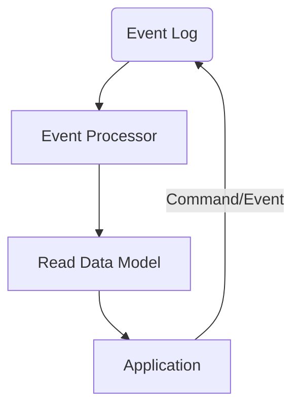

---
hide:
  - toc
---

	<h1>The Nexus Event Sourcing Framework</h1>
	
	   
    Event Sourcing for single process desktop applications.
     
    

## About

Event Sourcing, and more commonly CQRS, are patterns that are becoming more and more popular in the software industry especially
for large scale distributed systems. They are also patterns that fit well into a immutable state systems, or systems that wish
to track modifications to data and provide ways of auditing or undoing changes.

The term "Event Sourcing" was coined by [Martin Fowler in 2005](https://martinfowler.com/eaaDev/EventSourcing.html), and is described as:

!!! info "Event Sourcing ensures that all changes to application state are stored as a sequence of events. Not just can we query these events, we can also use the event log to reconstruct past states, and as a foundation to automatically adjust the state to cope with retroactive changes."

These features solve several problems we experience in the Nexus Mods App, namely:

* A strongly typed data model that can be quickly loaded from disk
* A way to track changes to the data model
* A way to undo changes to the data model
* A way to adapt the data model to changes in the data model, if a property changes from a string to a number, how do
  we adapt the data model to this change?

!!! tip "The concept of event sourcing is simple, given a set of events, the state of the system is then `aggregate({}, events) -> state`. All the state is the result of applying all the events in order"

What is interesting to note is that this pattern is very abstract, leaving a lot of room for optimization and customization. One such
customization is the idea of CQRS, or Command Query Responsibility Segregation. This is the idea that the system should be split into
two parts, the command side and the query side. The command side is responsible for handling commands, or actions that change the state
of the system. The query side is responsible for handling queries, or actions that read the state of the system. This pattern further
aligns with the idea of immutability, as the command side is the only side that can change the state of the system, and the query side
can be optimized for reading.

The overall architecture of a CQRS system is something like this:

* Events are sent into the Event Log, this storage is considered the "source of truth" for the system
* An event processor takes these events and uses them to manipulate the read data model
* The application then reads from the read data model
* The application can also send commands to the event log to modify the model
