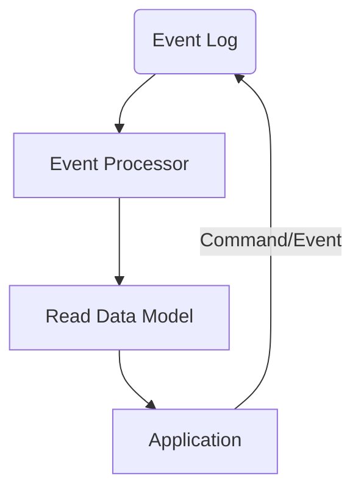

---
hide:
  - toc
---

	<h1>The Nexus Event Sourcing Framework</h1>
	
	   
    Event Sourcing for single process desktop applications.
     
    

## About

Event Sourcing, and more commonly CQRS, are patterns that are becoming more and more popular in the software industry especially
for large scale distributed systems. They are also patterns that fit well into a immutable state systems, or systems that wish
to track modifications to data and provide ways of auditing or undoing changes.

The term "Event Sourcing" was coined by [Martin Fowler in 2005](https://martinfowler.com/eaaDev/EventSourcing.html), and is described as:

!!! info "Event Sourcing ensures that all changes to application state are stored as a sequence of events. Not just can we
query these events, we can also use the event log to reconstruct past states, and as a foundation to automatically adjust the state to cope with retroactive changes."

These features solve several problems we experience in the Nexus Mods App, namely:

* A strongly typed data model that can be quickly loaded from disk
* A way to track changes to the data model
* A way to undo changes to the data model
* A way to adapt the data model to changes in the data model, if a property changes from a string to a number, how do
  we adapt the data model to this change?

!!! tip "The concept of event sourcing is simple, given a set of events, the state of the system is then `aggregate({}, events) -> state`. All the state is the result of applying all the events in order"

What is interesting to note is that this pattern is very abstract, leaving a lot of room for optimization and customization. One such
customization is the idea of CQRS, or Command Query Responsibility Segregation. This is the idea that the system should be split into
two parts, the command side and the query side. The command side is responsible for handling commands, or actions that change the state
of the system. The query side is responsible for handling queries, or actions that read the state of the system. This pattern further
aligns with the idea of immutability, as the command side is the only side that can change the state of the system, and the query side
can be optimized for reading.

The overall architecture of a CQRS system is something like this:

* Events are sent into the Event Log, this storage is considered the "source of truth" for the system
* An event processor takes these events and uses them to manipulate the read data model
* The application then reads from the read data model
* The application can also send commands to the event log to modify the model

!!! tip "The event log is the source of truth for the system, and the read data model is a projection of the event log. The read data model can be rebuilt at any time by replaying the events in the event log"

## Nexus Event Sourcing Framework

A major issue in event sourcing systems is allowing for the system to adapt to changes in the model over time, while the concept of events mutating a state is simple,
the actual implementation can be quite complex. This framework reworks many aspects of the Event Sourcing model in order to present an interface that
is easier to maintain, adapt and extend in extension code.

This framework takes heavy inspiration from [Datomic](https://docs.datomic.com/pro/index.html), an immutable, tuple oriented, single writer, parallel reader database system. Unfortunately,
Datomic is not open source, is written in Java, and not designed for a single process desktop application. However the information available about
the database is very insightful and we are leveraging many aspects of its design in our framework.

!!!info
    While the Nexus Event Sourcing framework takes inspiration from Datomic, and although one of the authors (halgari) used to work for Cognitect (the company behind Datomic at the time),
this project is a 100% clean room implementation and does not contain any code from Datomic, nor have any of its authors ever seen the source code of Datomic. The main distinctions between
the two is that Datomic is primarilly focused on a distributed system, and the Nexus Event Sourcing framework is only designed for a single process application.

### Data format
Data is stored as a series of tuples, in the format of `[entity, attribute, value, transaction, op]` where each of these has a specific meaning:

* `entity` - 64bit long - The entity id the tuple is associated with
* `attribute` - 64bit long - The attribute id the tuple is associated with
* `value` - The value of the tuple, a binary blob who's format is defined by the attribute's `NativeType` in the schema
* `transaction` - 64bit long - The transaction id the tuple is associated with
* `op` - 1bit flag - The operation that was performed on the tuple, either `Assert` or `Retract`

It is interesting to note that the `transaction` id is a 64bit long, and is used to order the tuples in the event log, transactions are monotonic and always increasing.
This is a key feature of the system, as it allows us to order the events in the event log, and also allows us to replay the events in the event log in order to rebuild the read data model.

Attributes and transactions are also entities, and are put into a separate `partition` via a prefix on their ids. The top byte of an ID is the partition, the actual value of these partition
prefixes don't matter much, but it should be noted that the first partition is the partition for attributes, so at any time a quick check of the first byte in an entity id can tell us if it's an attribute id or not.

Data is stored in several indexes which can be queried to find a specific datom (or datom that is closest to a specific datom), from there the data is stored in a sorted
set so iterators can move forward and backwards through the data. By varying the order in which the parts of the datoms are sorted, we can efficently navigate through a model.

