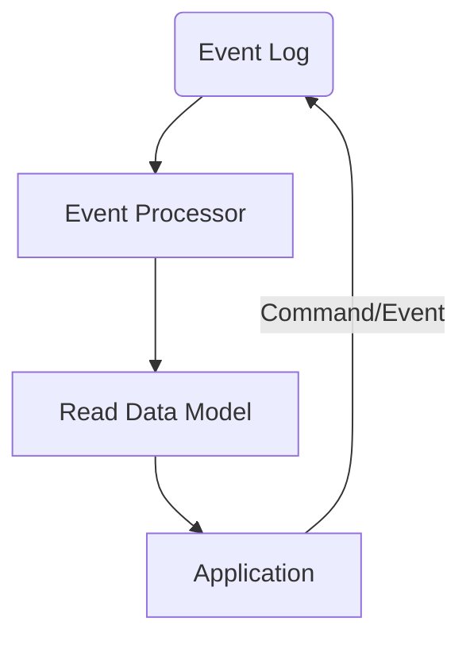

---
hide:
  - toc
---

<div align="center">
	<h1>The Nexus Event Sourcing Framework</h1>
	
	<br/> <br/>
    Event Sourcing for single process desktop applications.
    <br/>
    
</div>

## About

Event Sourcing, and more commonly CQRS, are patterns that are becoming more and more popular in the software industry especially
for large scale distributed systems. They are also patterns that fit well into a immutable state systems, or systems that wish
to track modifications to data and provide ways of auditing or undoing changes.

The term "Event Sourcing" was coined by [Martin Fowler in 2005](https://martinfowler.com/eaaDev/EventSourcing.html), and is described as:

!!! info "Event Sourcing ensures that all changes to application state are stored as a sequence of events. Not just can we query these events, we can also use the event log to reconstruct past states, and as a foundation to automatically adjust the state to cope with retroactive changes."

These features solve several problems we experience in the Nexus Mods App, namely:

* A strongly typed data model that can be quickly loaded from disk
* A way to track changes to the data model
* A way to undo changes to the data model
* A way to adapt the data model to changes in the data model, if a property changes from a string to a number, how do
  we adapt the data model to this change?

!!! tip "The concept of event sourcing is simple, given a set of events, the state of the system is then `aggregate({}, events) -> state`. All the state is the result of applying all the events in order"

What is interesting to note is that this pattern is very abstract, leaving a lot of room for optimization and customization. One such
customization is the idea of CQRS, or Command Query Responsibility Segregation. This is the idea that the system should be split into
two parts, the command side and the query side. The command side is responsible for handling commands, or actions that change the state
of the system. The query side is responsible for handling queries, or actions that read the state of the system. This pattern further
aligns with the idea of immutability, as the command side is the only side that can change the state of the system, and the query side
can be optimized for reading.

The overall architecture of a CQRS system is something like this:



* Events are sent into the Event Log, this storage is considered the "source of truth" for the system
* An event processor takes these events and uses them to manipulate the read data model
* The application then reads from the read data model
* The application can also send commands to the event log to modify the model

!!! tip "The event log is the source of truth for the system, and the read data model is a projection of the event log. The read data model can be rebuilt at any time by replaying the events in the event log"

## Nexus Event Sourcing Framework

This framework takes heavy inspiration from [Datomic](https://docs.datomic.com/pro/index.html), an immutable, tuple oriented, single writer, parallel reader database system. Unfortunately,
Datomic is not open source, is written in Java, and not designed for a single process desktop application. However the information available about
the database is very insightful and we are leveraging many aspects of its design in our framework.

!!!info
    While the Nexus Event Sourcing framework takes inspiration from Datomic, and although one of the authors (halgari) used to work for Cognitect (the company behind Datomic at the time),
this project is a 100% clean room implementation and does not contain any code from Datomic, nor have any of its authors ever seen the source code of Datomic. The main distinctions between
the two is that Datomic is primarilly focused on a distributed system, and the Nexus Event Sourcing framework is only designed for a single process application.

### Data format
Data is stored as a series of tuples, in the format of `[entity, attribute, value, transaction, op]` where each of these has a specific meaning:

* `entity` - 64bit long - The entity id the tuple is associated with
* `attribute` - 64bit long - The attribute id the tuple is associated with
* `value` - The value of the tuple, a binary blob who's format is defined by the attribute's `NativeType` in the schema
* `transaction` - 64bit long - The transaction id the tuple is associated with
* `op` - 1bit flag - The operation that was performed on the tuple, either `Assert` or `Retract`

It is interesting to note that the `transaction` id is a 64bit long, and is used to order the tuples in the event log, transactions are monotonic and always increasing.
This is a key feature of the system, as it allows us to order the events in the event log, and also allows us to replay the events in the event log in order to rebuild the read data model.

Attributes and transactions are also entities, and are put into a separate `partition` via a prefix on their ids. The top byte of an ID is the partition, and by default the following partitions are defined:

* `0x00` - The attribute partition
* `0x01` - The transaction partition
* `0x03` - The tempid partition (used for assigning temporary ids to entities that will be resolved to actual IDs when a transaction is committed)
* `0x04` - The entity partition
* `0x05`+ - Unused, could be used for user defined partitions

Data is stored in RocksDB, with the value of each entry being mostly unused. Instead the same key is interested into several column families, each with a separate comparator. This same comparator
is used during query to perform a binary searh to a specific value. From that point the iterator can be used to move forwards and backwards in the column family to find the specific tuples.

### Key format
Keys in rocksdb are slightly bitpacked to save space. More advanced packing is possible, but the more packing tha that is performed, the more complex the comparison code becomes,
so it's a tradeoff between space and speed. The format of the key is as follows:

`[Entity(ulong),Transaction(ulong), Op + Attribute(ushort)]`

The top bit of the `ushort` value is the op (1 = Assert, 0 = Retract), and the remaining 15 bits can be cast to a ulong to get the Attribute entity ID. This means that Entity and transaction space are limited to 2^58,
and the attribute space is limited to 2^15. It is assumed that 32K distinct attributes is enough for anyone.

!!!info
    A prototype was done where the entity and transaction values were 34bit unsigned integers, the attribute was 11bits, with a 1 bit op. This resulted in 2^11 distinct attributes, and a 10byte key, instead of an 18byte key in the final design.
However, looking at the generated machine code, it was clear that the key comparison code involved a lot more bit shifting and unaligned memory acces, and so the complexity was considered not worth the 8 byte saving.

### Indexes
There are several indexes that are required for the system to function properly:

But first let's define some common abbreviations:

* `E` - Entity id
* `A` - Attribute id
* `V` - Value blob
* `T` - Transaction id
* `O` - Operation flag

* TxLog - this is simply all the datoms in the system, ordered by transaction id, this can be used to ask questions like "What was inserted in the last transaction"
* EATOV - this is the primary index, and is used to find all the tuples associated with a specific entity, this can be used to ask questions like "Find all the attributes set on this mod"
* AVTEO - this is a reverse index, and is used to find all the entities that have a given value for a given attribute, this can be used to ask questions like "Find all mods that are enabled"
* VAETO - this is a reverse index, and is used to find all the entities that have a specific value. Normally this is only used on attributes who's value is of type `entity reference`. This can be used to ask questions like "Find all mods that point to this loadout"

### Sorting
Since all the sorting is performed by C# code injected into RocksDB via the `Comparator` interface, (via native function calling), the sorting follows C#'s rules for sorting. This means
we can use C#'s `IComparable` interfaces and define per-value-type sorting rules. This is useful for things like string and filepath sorting. The stored in each key in RocksDB is the same across all column families,
it's only the comparator that changes which results in a different sorting order.

### Querying
Internally, RocksDB offers a "SeekPrev" operator which says: "Find the first key that is less than or equal to this key". This allows us to construct a tuple with each value set to either a minimum or max value, and then use the SeekPrev to find the
next matching tuple.

For example, if we want to load all the attributes for Entity Id 42 as of transaction 100, we can construct a tuple with the following values:

`[42, ulong.MaxValue, null, 100, 1]`

Then we would `SeekPrev` to find the first matching tuple, and return it. Then we would take the attribute Id from that tuple, and update the tuple's attribute to the attribute id we just got, minus 1, and then `SeekPrev` again.
We continue this process until we find a tuple that doesn't match the entity id, or we run out of tuples.

Since 'Retract' has a flag of 0, and we don't allow a assert and retract in the same transaction, we will always get the correct value for the attribute at the given transaction. Also since the transaction id is monotonic, we can stop the search when we find the first transaction id
that is less than the transaction id we are looking for.

!!!info
     Observant readers will realize this means that value trashing (values that change a lot) will result in lots of seeks for a single entity. If this becomes a performance problem we can borrow a concept from Datomic and have a `Current` index
which is a separate index that only contains the most recent assertions for each entity, this can then be filtered by Tx first, and any tuples that are more recent than the Tx we are looking for can be looked up in the `History` index. This would result
in a single seek for eacn entity, and then a linear scan of the attributes for that entity, with the fallback to the `History` index if the `Current` index doesn't contain the value we are looking for.

### Schema
As mentioned attributes and transactions are entities. This means we can add additional data to these entities, such as `TransactionTime` to a transaction, or `NativeType` to attributes. Not much more to say about this feature here, except that the schema
from the C# code is injected into the database itself so that we can re-query it on application startup to validate that code changes are compatible with the database schema.


## Core Interfaces

### IDatomStore
This interface isn't often encountered by users, but it's the core interface for inserting and reading datoms. It calls RocksDB and ensures that the data is properly indexed. It also offers basic iterators for reading each index. If we ever implement
a `Current` index, it will be implemented here.

### IConnection
Represents a writable connection to a database. This is named `Connection` mostly because that's what Datomic calls it, and it's the closest thing to a database connection in the system. This is all in-process so there's no network involved.
This class can create transactions, and dereference to a database. It has a `IDb Current {get;}` property that returns the most recent copy of the database, which is really just an `IDb` with the `Tx` value set to the most recent transaction id.

### IDb
An immutable database. This is the main interface for querying data from the database, queries from this interface will always return the same data. If more recent data is required, a new `IDb` must be created from a `IConnection` with a new transaction id.

## ITransaction
Created when a user calls `IConnection.BeginTransaction()`. This is a mutable object that can be used to insert datoms. When the transaction is commited, it will return a new `IDb` with the new transaction id, and a resolution function for resolving tempids to real ids.

Example:

Let's say we have an Entity structure named `Mod` and we're creating a new mod, we would construct this entity, passing in the transaction. Internally the entity would be assigned a tempid,
and that value will be returned by the `Insert` method. When the transaction is committed, that tempId can be resolved to a real id:

```csharp

using var tx = conn.BeginTransaction();
var mod = new Mod(tx)
{
    Name = "My Mod",
    Enabled = true
};

var file = new ModFile(tx)
{
    Path = "C:\\",
    Mod = mod.Id,
};
var resultSet = tx.Commit();

var db = resultSet.NewDb; // Could also call conn.Current
db[resultSet[mod.Id]].Name; // "My Mod", as resultSet has resolved the tempid to a real id assigned during the commit
```

## Entity Models
There are several types of models in this framework to handle the 3 main uses of grouping attributes into entities:

* Read Model - A collection attributes into a readonly object. For example, a `Mod` entity might have a `Name` and `Enabled` attribute, and so we'd need a `Mod` entity would be a read model.
* Write Model - A init-only collection of attributes into a writeable object. This is used to create new entities, and is used in the `ITransaction` interface.
* Active Read Model - A collection of attributes into a readonly object, but one that retains a reference to the connection that created it, as new data is written to the database, the active read model filters
this data and emits `INotifyPropertyChanged` events to any listeners. This is used to create a live view of the database

## Defining Code Models

The code model system in this framework uses code generation to create the attributes and read models

### Attributes
Attributes are defined by creating a static class and giving it a name that helps define the namespace for the attributes:

```csharp
namespace NexusMods.Model;

public partial static class Mod
{
    public static readonly AttributeDefinitions AttributeDefinitions =
        new AttributeDefinitionsBuilder()
            .Define("Name", NativeType.String, "A name for the mod")
            .Define("Enabled", NativeType.Bool, "True if the mod is enabled")
            .Build();
}
```

The code generator will find this class, and generate attributes classes for the specified definitions. These will be generated as `NexusMods.Model.Mod/Name` and `NexusMods.Model.Mod/Enabled`. For
the name and namespaces respectively.

!!!info
    The code generator will create a matching static DI method called `AddMod` that will add DI entries for the attribute definitions and the attribute classes.


### Read Models
Read models are defined much in the same way as attributes, as a collection of attributes:

```csharp
namespace NexusMods.Model;

public partial static class Mod
{
    public static readonly AttributeDefinitions AttributeDefinitions =
        new AttributeDefinitionsBuilder()
            .Define<string>("Name", "A name for the mod")
            .Define<bool>("Enabled", "True if the mod is enabled")
            .Build();

    public static readonly ModelDefinition ModelDefinition =
        new ModelDefinitionBuilder()
            .Include<Enabled, Name>()
            .Build();
}
```

Internally this will generate 3 classes, for the `ReadModel`, `WriteModel`, and `ActiveReadModel` respectively. It will also generate several static extension methods for the `IDb` and `ITransaction` interfaces to make it easier to work with these models.
The write model method isn't a class, but a method that takes a `ITransaction` and returns a `ReadModel` interface.

```csharp

using var tx = conn.BeginTransaction();
var mod = tx.NewMod(
    Name = "My Mod",
    Enabled = true
);

var file = tx.NewModFile(
    Path = "C:\\",
    Mod = mod.Id,
);
```

For querying, several extension methods are generated for the `IDb` and `IConnection` interfaces:

```csharp

var results = db.GetMod(id);
var activeResults = conn.GetActiveMod(id);

var mods = from mod in db.GetMods()
           where mod.Enabled
           select mod;

foreach (var mod in mods)
{
    Console.WriteLine(mod.Name);
}
```

Read models can also include other read models:

```csharp

namespace NexusMods.Model;

public partial static class NexusMod
{
    public static readonly AttributeDefinitions AttributeDefinitions =
        new AttributeDefinitionsBuilder()
            .Define<ulong>("FileId", "Nexus File Id")
            .Define<ulong>("ModId", "The name of the mod")
            .Build();

    public static readonly ModelDefinition ModelDefinition =
        new ModelDefinitionBuilder()
            .Inherits<Mod>()
            .Include<FileId, ModId>()
            .Build();
}
```

### Updating
For a single update to a specific attribute on an entity, the `ITransaction` interface has an emit method to update a specific datom:

```csharp

var someMod = db.GetMod(id);

using var tx = conn.BeginTransaction();
// this seems too verbose, we'll think about this one
Mod.Enabled.Emit(tx, someMod.Id, false);
```